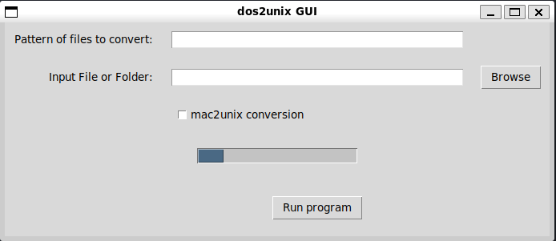

# dos2unix-GUI

A fast lightweight linux GUI wrapper for dos2unix

## Installation

1. Install [dos2unix](https://ioflood.com/blog/install-dos2unix-command-linux/) based on your linux distribution.
2. Install [tk](https://www.geeksforgeeks.org/how-to-install-tkinter-on-linux/) based on your linux distribution.
3. Download 

## Usage

If the patterm option is left empty, when you browse, you will select an input file.
If you use a pattern option like `*.txt` when you click browse you will select the folder your input files are located.
**Note 1: This dos2unix GUI program creates a newline at the end of the file if it doesn't exist.**
**Note 2: If you wanna convert mac format files to unix, click on the mac2unix box.**
